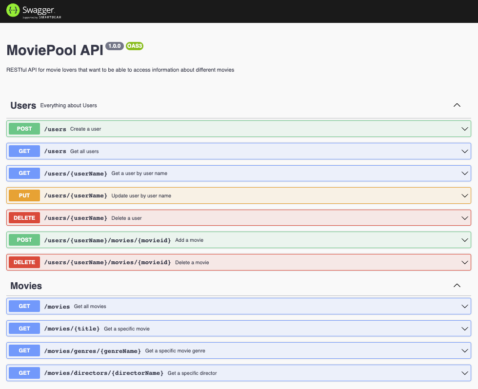

# MoviePool API

### What is this about?
A RESTful API for movie lovers that want to be able to access information about different movies. It’s the M, E and N from the MERN stack and connects to a database that is hosted on MongoDB Atlas.

[Find the R here.](https://github.com/EllyPirelly/cf-movie-client)

This RESTful API has been built split into several tasks for Achievement 2 and 3 in [Career Foundry's Full-Stack Web Development Program](https://careerfoundry.com/en/courses/become-a-web-developer/).

### TODO - Swagger API documentation
- TODO at the moment swagger's still a feature branch

- this is OLD and will be deleted as soon as swagger doc is done! https://documenter.getpostman.com/view/26201251/2s93RRvDAq

### Technical requirements
- MERN stack must be used (MongoDB, Express, Node.js)
- API
  - must use RESTful architecture
  - must at least use commonly used HTTP methods (`POST`, `GET`, `PUT`, `DELETE`), following CRUD
  - must at least use 3 middleware functions
  - must be tested in Postman - [web](https://web.postman.co/) or [app](https://www.postman.com/downloads/)
  - business logic must be modeled with Mongoose
  - must include user authentication and authorization
  - must include data validation logic
  - must meet data security regulations
  - must be documented - TODO: swagger
  - must be deployed to either [Heroku](https://www.heroku.com/) or [Render](https://render.com/)
- the database
  - must be non-relational
  - must contain two collections: `users` `movies` with various documents
  - must be build using MongoDB (MongoDB Community Server, Mongo Shell, MongoDB Database Tools) with "code first" approach: first design endpoints, then design database
  - must be hostet on [MongoDB Atlas](https://www.mongodb.com/atlas/database)

### Feature requirements / Accessible information, defining the endpoints
`users`
- new users
  - are able to sign up
    - userName
    - password
    - email
    - birthDate
- registered users
  - are able to login
    - userName
    - password
  - are able to logout
- registered users - when logged in
  - are able to update their personal information
    - userName
    - password
    - email
    - birthDate
    - favoriteMovies
  - have access to information about movies
  - are able to add a movie to their list of favoriteMovies
  - are able to delete a movie off of their list of favoriteMovies
  - are able to delete their account

`movies`
- return a list of all movies
- return data about a single movie by title
  - title
  - description
  - genre
    - genreName
    - description
  - director
    - directorName
    - bio
    - birthDate
    - deathDate
  - imagePath
  - featured
- return data about a genre by genreName (e.g. "Thriller")
- return data about a director by directorName
  - bio
  - birthDate
  - deathDate

### Languages, Libraries, Frameworks, Tools
- (HTML)
- JavaScript
- Node.js - https://nodejs.org/en/
- MongoDB - to build the non-relational database which is hosted on MongoDB Atlas
  - `brew tap mongodb/brew` to install the MongoDB custom 'tap'
  - `brew install mongodb-community` - will install the latest available production release of MongoDB Community Server, Mongo Shell, MongoDB Database Tools
- MongoDB Community Server
  - any time one wants to interact with the database, view the app or use Mongo Shell
- Mongo Shell
  - start the MongoDB Community Server, you need to have it running any time you want to interact with your database, view your app, or use the Mongo shell `brew services start mongodb-community`
  - run `mongosh`
  - exit with `exit` or `quit()`
  - stop the MongoDB Community Server `brew services stop mongodb-community`
  - https://www.mongodb.com/docs/manual/tutorial/install-mongodb-on-os-x/
  - https://github.com/mongodb/homebrew-brew

### Dependencies
- `bcrypt` for password hashing
- `body-parser` to read the body of HTTP requests to get additional information not stored in the request URLs
- `cors` to control which domains have access to the API
- `express` server-side minimalist programming framework for Node.js
- `express-validator` for server-side validation
- `jsonwebtoken` for token-based authentication, via Bearer token
- `mongoose` for defining the data schema, for data modeling the business logic, for creating the models/the business logic layer and for connecting to the database (to install Mongoose, the MongoDB Server must be up)
- `morgan` as soon as the server is started, this will log time and date of the request, request method, URL path, response code, number of characters the response sent back to the terminal and to the `log.txt` you find in the project
- `passport`, `passport-jwt`, `passport-local` for authentication and authorization
- `uuid` to generate unique IDs - not used at the moment

### Dev Dependencies
- `dotenv` to create an environment variable to connect to the remote MongoDB Atlas URI
- `nodemon` for watching for any changes in the code and automatically restarting the server

### Engines
- `"node": ">=14 <15"` explicitely set due to a MongoDB error in connection to hosting on Render, see here: [Specifying a Node version](https://render.com/docs/node-version)

### How to run this?
- clone project
- `cd` into project
- run `npm install`
- beware of the `.env` file that is not committed; when cloning, you won't have the `CONNECTION_URI` variable and you won't have the assigned value (the MongoDB URI) so the project won't work

#### How to start the server with Nodemon
- `cd` into correct directory and start server with `npm run dev`
- this will start the project on `http://localhost:8080/`
- TODO: at the moment this fires a GET request, what's best to display here?
```
app.get('/', (req, res) => {
  res.status(200).send('Check this API out.');
});
```
- this will run/watch changes in your code and will keep you from always manually exiting and restarting Node with every code change
- stop the server with `ctrl c`

#### How to start the server with only Node.js
- `cd` into correct directory and start the server with `node index.js`
- TODO: at the moment this fires a GET request, what's best to display here?
```
app.get('/', (req, res) => {
  res.status(200).send('Check this API out.');
});
```
- for each change in code, you need to manually exit and restart the server
- stop the server with `ctl c`

#### How to test endpoints in Postman
- https://www.postman.com/
- `cd` into correct directory and start Node.js repl terminal with `node index.js` or `npm run dev` if you use Nodemon
- go to Postman (either browser or app)
- test the endpoints
